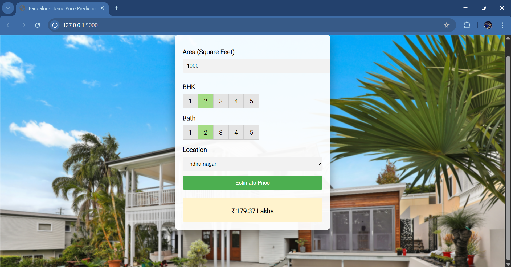

# 🏠 Bangalore House Price Prediction – Full Stack ML Project

This project is an end-to-end machine learning web application that predicts house prices in Bangalore based on user inputs such as location, total square feet, number of bedrooms (BHK), and bathrooms. \
The system integrates data science, machine learning, backend API development, and frontend UI into a single working application.

## 🚀 Project Overview

The project follows a complete ML lifecycle:

- Data Collection & Cleaning
- Feature Engineering & Outlier Removal
- Model Training & Evaluation
- Model Serialization
- Backend API using Flask
- Interactive Web UI using HTML, CSS & JavaScript

Users can interact with the web interface, submit property details, and receive an estimated house price in real time.

## 🧠 Machine Learning Details

Dataset: Bengaluru House Prices (Kaggle) \
Algorithm Used: Linear Regression \
Model Selection: 
1. Linear Regression 
2. Lasso Regression
3. Decision Tree Regressor

Hyperparameter tuning using GridSearchCV. \
Validation using ShuffleSplit Cross-Validation. \
Best performing model selected based on R² score.

Key ML Concepts Applied:
- Missing value handling
- Feature extraction (BHK from size)
- Area conversion (range & unit handling)
- Outlier detection (price per sqft, BHK anomalies)
- Dimensionality reduction (location grouping)
- One-hot encoding
- Model persistence using Pickle

## 🏗️ Project Structure

```text
HOUSE PRICE PREDICTION
│
├── client/                     # (Optional standalone frontend)
│
├── model/
│   ├── bengaluru_house_prices.csv
│   └── House_price_prediction.ipynb
│
├── screenshots/
│   └── Demo.png                 # UI demo screenshot
│
├── server/
│   ├── artifacts/
│   │   ├── banglore_home_prices_model.pickle
│   │   └── columns.json
│   │
│   ├── static/
│   │   ├── script.js
│   │   └── style.css
│   │
│   ├── templates/
│   │   └── index.html
│   │
│   ├── server.py
│   └── util.py
│
└── README.md
```

## 🌐 Web Application Features

- Dynamic location list loaded from backend
- Real-time price prediction
- Clean, responsive UI
- RESTful API integration
- CORS-enabled backend
- Error-free frontend–backend communication

## 📸 Demo Screenshot



## 🛠️ Technologies Used

### Programming & Data Science

- Python
- NumPy
- Pandas
- Matplotlib
- Scikit-learn

### Backend

- Flask
- Pickle
- REST APIs

### Frontend

- HTML
- CSS
- JavaScript
- jQuery

### Tools & IDEs

- Jupyter Notebook
- Visual Studio Code
- Git & GitHub

## 📡 API Endpoints

### Get Locations
```text
GET /get_location_names
```
### Predict House Price
```text
POST /predict_home_price
```

### Parameters:

- location
- total_sqft
- bhk
- bath

## 📈 Sample Prediction Logic

The model predicts price based on:

- Property size
- Room distribution
- Location-based pricing patterns
- Historical market trends learned from data

The predicted value is returned in Lakhs (INR).

## 🎯 Learning Outcomes

- Built a real-world ML project
- Understood full ML pipeline
- Deployed ML model using Flask
- Connected frontend with backend APIs
- Debugged real production-like issues
- Learned ML behavior interpretation (feature influence)

## 👤 Author

Vedant Patil \
Artificial Intelligence & Data Science \
Aspiring Data Scientist, ML and AI Engineer

## ⭐ If you like this project

Give it a ⭐ on GitHub and feel free to fork or improve it!